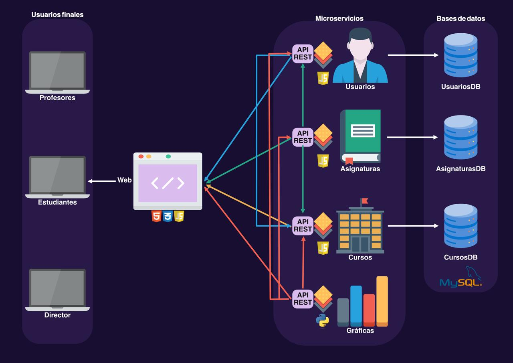

# Proyecto Redes e Infraestructura - Parte 1

El propósito de este proyecto es aplicar los conceptos aprendidos en la primera parte del curso mediante el desarrollo de una aplicación web básica que resuelva un problema contextual. La aplicación está enfocada en la visualización de datos a través de dashboards interactivos que muestran información almacenada en bases de datos, utilizando un dataset existente.

El proyecto consiste en una plataforma para la gestión centralizada de programas académicos. La aplicación permitirá a los estudiantes inscribirse en cursos, consultar calificaciones y seguir su rendimiento académico; a los profesores, gestionar cursos y registrar notas; y al administrador del programa, supervisar usuarios, cursos y asignaturas. Además, incluirá herramientas de análisis visual para evaluar el rendimiento estudiantil y explorar patrones socioeconómicos y demográficos, con el fin de mejorar la toma de decisiones y la calidad educativa.

Para el desarrollo de este proyecto se hizo uso del siguiente dataset: https://www.kaggle.com/datasets/thedevastator/higher-education-predictors-of-student-retention/data

## Tabla de Contenidos

1. [Instalación y uso](https://github.com/natam226/proyecto_curso_redes/edit/main/README.md#instalaci%C3%B3n-y-uso)
2. [Arquitectura](https://github.com/natam226/proyecto_curso_redes/edit/main/README.md#arquitectura)
3. [Tecnologías](https://github.com/natam226/proyecto_curso_redes/edit/main/README.md#tecnolog%C3%ADas)

## Instalación y uso

1. Clonar este repositorio:
    
    ```bash
    git clone <https://github.com/natam226/proyecto_curso_redes>
    
    ```
    
2. Navegar al directorio del proyecto:
    
    ```bash
    cd proyecto_curso_redes
    
    ```
    
3. Instalar las dependencias requeridas:
    - Para USUARIOS y ASIGNATURAS
        
        ```bash
        npm install express morgan mysql mysql2
        
        ```
        
    - Para CURSOS
        
        ```bash
        npm install axios express morgan mysql mysql2
        
        ```
        
    - Para GRAFICAS
        
        ```bash
        python3 -m pip install flask requests pandas plotly Flask_cors --no-warn-script-location
        
        ```
        
4. Ejecutar los microservicios
    
    Dirigirse a cada uno de los directorios de los microservicios y lanzarlos independientemente:
    
    - Para CURSOS, ASIGNATURAS y USUARIOS:
        
        ```bash
        node src/index.js
        
        ```
        
    - Para GRAFICAS:
        
        ```bash
        python src/app.py
        
        ```
        
5. Acceder a la interfaz web

## Arquitectura



## Tecnologías

- **Frontend**: HTML, CSS y JavaScript
- **Backend**: Node.js, Flask, JavaScript, Python
- **Base de Datos**: MySQL
